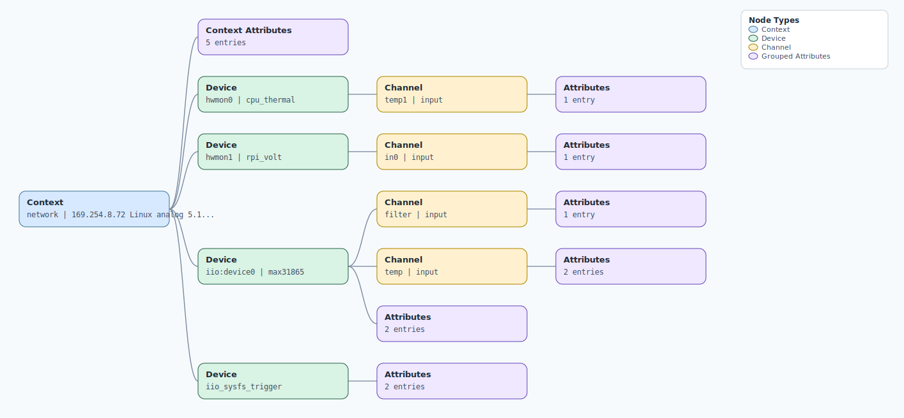

.. This file is auto-generated by doc/gen_emu_xml_trees.py.
   Do not edit manually.

Emulation Context: max31865.xml
===============================

Source XML: ``test/emu/devices/max31865.xml``

Diagram
-------

.. Note:: The diagram intentionally groups large attribute lists to keep
   the structure readable.

Text Preview
------------

.. code-block:: text

   context name=network description=169.254.8.72 Linux analog 5.10.63-v7l+ #2 SMP Tue Mar 7 14:22:31 +08 2023 armv7l
   |-- context-attribute name=dtoverlay value=vc4-kms-v3d,max31865
   |-- context-attribute name=hw_carrier value=Raspberry Pi 4 Model B Rev 1.1
   |-- context-attribute name=ip,ip-addr value=169.254.8.72
   |-- context-attribute name=local,kernel value=5.10.63-v7l+
   |-- context-attribute name=uri value=ip:169.254.8.72
   |-- device id=hwmon0 name=cpu_thermal
   |   `-- channel id=temp1 type=input
   |       `-- attribute name=input filename=temp1_input value=44790
   |-- device id=hwmon1 name=rpi_volt
   |   `-- channel id=in0 type=input
   |       `-- attribute name=lcrit_alarm filename=in0_lcrit_alarm value=0
   |-- device id=iio:device0 name=max31865
   |   |-- channel id=filter type=input
   |   |   `-- attribute name=notch_center_frequency filename=in_filter_notch_center_frequency value=60
   |   |-- channel id=temp type=input
   |   |   |-- attribute name=raw filename=in_temp_raw value=32767
   |   |   `-- attribute name=scale filename=in_temp_scale value=31.250000
   |   |-- attribute name=fault_ovuv value=0
   |   `-- attribute name=sampling_frequency_available value=50 60
