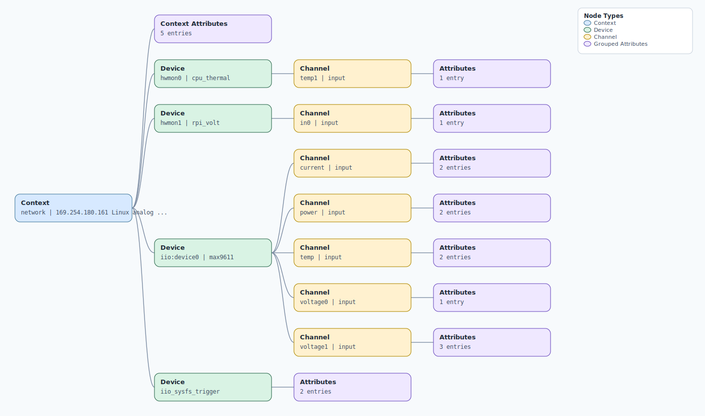

.. This file is auto-generated by doc/gen_emu_xml_trees.py.
   Do not edit manually.

Emulation Context: max9611.xml
==============================

Source XML: ``test/emu/devices/max9611.xml``

Diagram
-------

.. Note:: The diagram intentionally groups large attribute lists to keep
   the structure readable.

Text Preview
------------

.. code-block:: text

   context name=network description=169.254.180.161 Linux analog 5.10.63-v7l+ #2 SMP Tue Mar 7 14:22:31 +08 2023 armv7l
   |-- context-attribute name=dtoverlay value=vc4-kms-v3d,max9611
   |-- context-attribute name=hw_carrier value=Raspberry Pi 4 Model B Rev 1.4
   |-- context-attribute name=ip,ip-addr value=169.254.180.161
   |-- context-attribute name=local,kernel value=5.10.63-v7l+
   |-- context-attribute name=uri value=ip:169.254.180.161
   |-- device id=hwmon0 name=cpu_thermal
   |   `-- channel id=temp1 type=input
   |       `-- attribute name=input filename=temp1_input value=37485
   |-- device id=hwmon1 name=rpi_volt
   |   `-- channel id=in0 type=input
   |       `-- attribute name=lcrit_alarm filename=in0_lcrit_alarm value=0
   |-- device id=iio:device0 name=max9611
   |   |-- channel id=current type=input
   |   |   |-- attribute name=input filename=in_current_input value=2859.500000000
   |   |   `-- attribute name=shunt_resistor filename=in_current_shunt_resistor value=0.005000
   |   |-- channel id=power type=input
   |   |   |-- attribute name=input filename=in_power_input value=165167.730000000
   |   |   `-- attribute name=shunt_resistor filename=in_power_shunt_resistor value=0.005000
   |   |-- channel id=temp type=input
