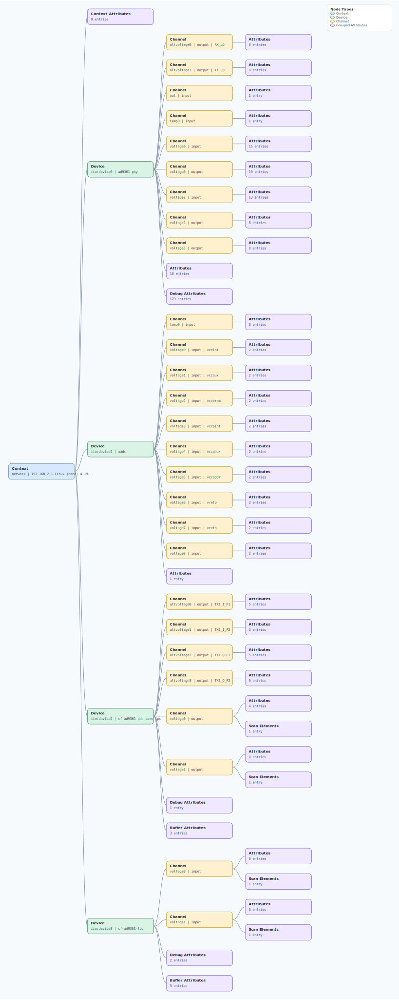

.. This file is auto-generated by doc/gen_emu_xml_trees.py.
   Do not edit manually.

Emulation Context: pluto.xml
============================

Source XML: ``test/emu/devices/pluto.xml``

Diagram
-------

.. Note:: The diagram intentionally groups large attribute lists to keep
   the structure readable.

Text Preview
------------

.. code-block:: text

   context name=network description=192.168.2.1 Linux (none) 4.19.0-119999-g6edc6cd #319 SMP PREEMPT Mon Jul 6 15:45:01 CEST 2020 armv7l
   |-- context-attribute name=ad9361-phy,model value=ad9363a
   |-- context-attribute name=ad9361-phy,xo_correction value=40000159
   |-- context-attribute name=fw_version value=v0.32
   |-- context-attribute name=hw_model value=Analog Devices PlutoSDR Rev.C (Z7010-AD9363A)
   |-- context-attribute name=hw_model_variant value=0
   |-- context-attribute name=hw_serial value=1044734c960500111e002e0041984fc267
   |-- context-attribute name=ip,ip-addr value=192.168.2.1
   |-- context-attribute name=local,kernel value=4.19.0-119999-g6edc6cd
   |-- context-attribute name=uri value=ip:pluto.local
   |-- device id=iio:device0 name=ad9361-phy
   |   |-- channel id=altvoltage0 type=output name=RX_LO
   |   |   |-- attribute name=external filename=out_altvoltage0_RX_LO_external value=0
   |   |   |-- attribute name=fastlock_load filename=out_altvoltage0_RX_LO_fastlock_load value=0
   |   |   |-- attribute name=fastlock_recall filename=out_altvoltage0_RX_LO_fastlock_recall value=ERROR
   |   |   |-- attribute name=fastlock_save filename=out_altvoltage0_RX_LO_fastlock_save value=0 79,79,79,79,79,79,79,79,79,79,79,79,79,79,79,79
   |   |   |-- attribute name=fastlock_store filename=out_altvoltage0_RX_LO_fastlock_store value=0
   |   |   |-- attribute name=frequency filename=out_altvoltage0_RX_LO_frequency value=2400000000
   |   |   |-- attribute name=frequency_available filename=out_altvoltage0_RX_LO_frequency_available value=[325000000 1 3800000000]
   |   |   `-- attribute name=powerdown filename=out_altvoltage0_RX_LO_powerdown value=0
